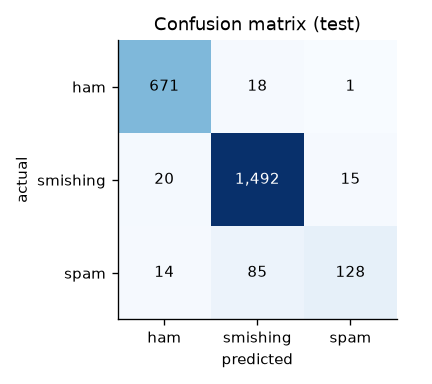
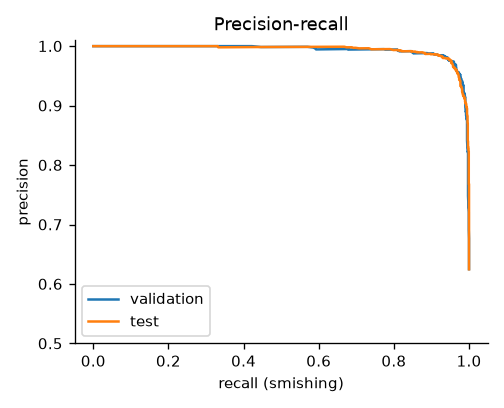
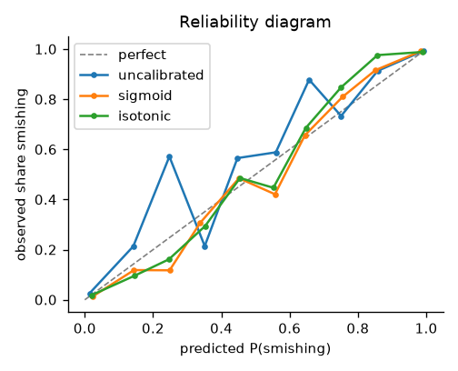

# ScamSleuth

**Forensic analysis for suspicious SMS, WhatsApp and email messages.**

[](https://github.com/rehanbigs/scamsleuth/actions/workflows/ci.yml)
[](pyproject.toml)
[](LICENSE)

People lost **$470 million** in 2024 to scams that started with a text message, more than five
times the 2020 figure ([FTC](https://www.ftc.gov/news-events/data-visualizations/data-spotlight/2025/04/top-text-scams-2024)).
ScamSleuth examines a suspicious message and explains whether it is a scam, what gives it
away, and what to do next.

## Highlights

- **Modern, leakage-safe data.** Combines a classic labelled corpus with 10k real smishing
  reports from 2017–2024. It removes 6,172 duplicates and groups near-duplicate campaign
  templates with MinHash LSH, so that no variant leaks from training into test.
- **Adversarial-aware entity extraction.** Finds URLs, emails, phone numbers and premium SMS
  short codes, even when scammers hide them behind zero-width characters, full-width dots,
  broken schemes (`http:/bit.do/...`) or defanged text, and recovers 99% of annotated links in
  the corpus.
- **Safe by construction.** Suspicious links are parsed as text only. They are never fetched
  or rendered, and they are always shown defanged (`hxxp://evil[.]com`).
- **Measured, not guessed.** Success is defined up front as smishing recall at a fixed
  false-alarm rate, because a missed scam costs far more than a false alarm.
- **Honest evaluation.** Results are reported per source and per scam type, with confidence
  intervals, and stress-tested on unseen languages and on genuine messages that look official.

## Quickstart

Requires [uv](https://docs.astral.sh/uv/).

```bash
git clone https://github.com/rehanbigs/scamsleuth.git
cd scamsleuth
uv sync                                   # create the environment
uv run python -m scamsleuth.data.prepare  # download, clean and split the datasets
uv run python -m scamsleuth.models.compare  # compare candidate models (logged to MLflow)
uv run python -m scamsleuth.models.train  # tune, calibrate, evaluate, save models/baseline.joblib
uv run pytest                             # run the test suite
```

### Extract indicators from a message

```python
>>> from scamsleuth.features.entities import extract_entities
>>> msg = "URGENT: your parcel is held. Pay the fee at http:/parcel-fee[.]top/pay or call 0844 861 85 85"
>>> extract_entities(msg).defanged()
Entities(urls=('hxxp://parcel-fee[.]top/pay',), emails=(), phones=('08448618585',), short_codes=())
```

## Dataset

| Source | Messages | Role |
|---|---:|---|
| [Mendeley SMS Phishing Dataset](https://doi.org/10.17632/f45bkkt8pr.1) (2022) | 5,825 | Labelled `ham` / `spam` / `smishing` corpus |
| [IMC 2025 smishing reports](https://github.com/reportsmishing/Smishing-Dataset-IMC25) (2017–2024) | 11,280 | Real modern scams: banking, delivery, government, telecom, "Hey Mum" |
| IMC 2025, non-English | 6,805 | Evaluation only: 58 languages |
| [Synthetic hard negatives](https://huggingface.co/datasets/Ridham115/indian-scam-sms-synthetic-audited) | 1,580 | Evaluation only: false alarms on genuine bank, courier and bill look-alikes |

All sources are CC BY 4.0 and are pinned and checksum-verified at build time.

| Split | ham | spam | smishing | Total |
|---|---:|---:|---:|---:|
| train | 3,449 | 1,133 | 7,634 | 12,216 |
| val | 690 | 227 | 1,528 | 2,445 |
| test | 690 | 227 | 1,527 | 2,444 |

Splits are stratified by source and class and grouped by near-duplicate template, with zero
overlap between them. The processing steps, cleaning rules and limitations are in the
[data card](docs/data.md), and the analysis is in the [EDA notebook](notebooks/01_eda.ipynb).

## Results

**Baseline: TF-IDF (word + character n-grams) + logistic regression**, isotonic-calibrated, with
the decision threshold set on validation for a 2% false-alarm budget. Test results, evaluated once:

| Evaluation | Measure | Result |
|---|---|---:|
| Test, all sources (2,444 messages) | Smishing recall | **97.7%** (95% CI 96.9–98.4) |
| | False-alarm rate on legitimate messages | 2.6% (target 2.0%) |
| | Smishing PR-AUC · macro F1 | 0.994 · 0.869 |
| Test, real 2017–2024 scams (IMC) | Smishing recall | 98.1% |
| | "Wrong number" conversational scams | 36% (9 of 25) |
| Test, 2022 corpus | Smishing recall | 91.3% (95% CI 85.0–97.5) |
| Unseen languages (6,805 scams, 58 languages) | Smishing recall | 76.7% (French 94%, German 50%, Japanese 27%) |
| Synthetic genuine look-alikes (783) | Wrongly flagged as smishing | **81.7%** |

The last row is the important limitation: every legitimate training message is personal chat, so
the model treats anything official-looking as a scam. It is the main target for the next model.
The [error analysis](reports/baseline_errors.md) explains the remaining mistakes.

<p>
  
  
  
</p>

### Model comparison (validation, 5-fold grouped CV on train)

| Model | CV PR-AUC | Recall at 2% false alarms | Macro F1 | Fit + CV time |
|---|---:|---:|---:|---:|
| Complement Naive Bayes | 0.992 | 95.7% | 0.862 | 26 s |
| **Logistic regression** | **0.995** | **97.6%** | **0.894** | 85 s |
| Linear SVM | 0.994 | 97.6% | 0.876 | 33 s |
| LightGBM on 17 red-flag features | 0.971 | 84.8% | 0.774 | 24 s |
| Stack (logistic regression + LightGBM) | 0.994 | 97.9% | 0.893 | 787 s |
| Logistic regression trained on 2022 data only | — | 95.1% | 0.699 | 7 s |

Logistic regression is kept: it ties for best and runs fast, and the stack adds about 3 caught
scams out of 1,528 at 9× the cost. Training on 2022 data alone keeps recall high but collapses
macro F1, because it cannot separate modern spam from smishing. Every run is tracked in MLflow.

## Project layout

```
src/scamsleuth/
├── data/        # download, validation, cleaning, de-duplication, splitting
├── features/    # entity extraction, defanging, red-flag features
├── models/      # candidate models, comparison, final training
└── eval/        # metrics, figures, error analysis
tests/           # unit tests (pytest)
notebooks/       # exploratory analysis
reports/         # metrics, figures, error analysis
docs/            # problem statement and data card
```

## Documentation

- [Problem statement and success metrics](docs/problem.md)
- [Data card](docs/data.md)
- [Error analysis](reports/baseline_errors.md)

## Development

```bash
uv run pre-commit install   # ruff + mypy run on every commit
uv run ruff check . && uv run mypy src tests && uv run pytest
```

CI runs linting, strict type checking and the test suite on Python 3.11, 3.12 and 3.13 for
every push and pull request.

## License

Code is released under the [MIT License](LICENSE). The dataset is © its authors and used
under [CC BY 4.0](https://creativecommons.org/licenses/by/4.0/).

ScamSleuth gives advice, not certainty. Always verify through an independent channel, for
example by calling the number printed on your bank card.
